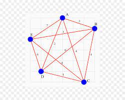

# le voyageur de commerce

## la problématique 

### Selon wikipédia :

> En informatique, le problème du voyageur de commerce, ou problème du commis voyageur1, est un problème d'optimisation qui consiste à déterminer, étant donné une liste de villes et les distances entre toutes les paires de villes2, le plus court circuit qui passe par chaque ville une et une seule fois.

> Malgré la simplicité de l’énoncé, on ne connaît pas d'algorithme permettant de trouver une solution exacte rapidement dans tous les cas.

L'intelligence humaine trouverait un chemin 'logique' pour essayer de déterminer une distance optimale, là où un ordinateur orgnaiserait un voyage aléatoire ; le pentagramme suivant est une bonne illustration pour montrer les différences de distances possibles, pour seulement 5 villes !

Nous pouvons donc résoudre facilement une problématique de voyage avec peu d'étapes, mais dès que le voyage se complexifie (nombre d'étapes, ajouts d'autres problématiques), il s'avère intéressant d'imaginer des façons de programmer un ordinateur pour nous aider.

## l'heuristique

Nous allons donc programmer l'ordinateur afin qu'il nous calcule un premier chemin cohérent. La stratégie choisie est de minimiser les distances entre chaque étape.

Pour ce faire, nous avons l'énoncé suivant : 

- nous connaissons les coordonnées de chaque étape
- nous calculons les distances en <i>ligne droite</i>

Nous écartons toute autre problématique, en imaginant un circuit routier (signalétique, facteurs humains...).

Pour le calcul des distances nous utilisons la distance euclidienne ; le langage python nous permet de créer une matrice avec avec ces distances et d'effectuer tous les calculs d'algèbre linéaire dont nous avons besoin. Le module Tkinter permet de visualiser ce chemin

Nous déterminons un point de départ et recherchons la plus petite distance pour trouver l'étape suivante, et ainsi de suite jusqu'à retourner au point de départ. Cette algorithmique correspond à un choix intelligent que nous imposons à la machine, c'est <i>l'heuristique</i>.

Nous appelerons le chemin trouvé le chemin heuristique par la suite. Voyons s'il est possible de l'améliorer !

## Les algorithmes :

Il nous a été proposé deux algorithmes pour améliorer notre voyage : <i>les fourmis, l'algorithme génétique.</i>

Nous choisissons l'algorithme génétique.

### l'algorithme génétique :  

De façon aléatoire, nous intervertissons deux 'villes' de la route heuristique, puis nous intervertissons deux blocs de villes. Si une meilleure route est trouvée, celle-ci est tracée dans TKinter et la distance affichée.

